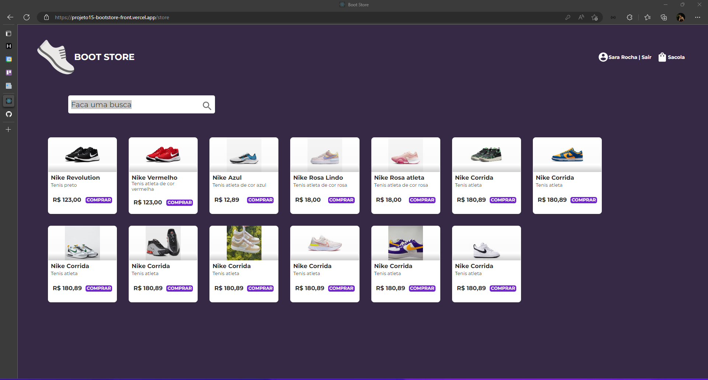

<h2  align="center">


</h2>


<p  align="center">

<a  href="#-projeto">Projeto</a>&nbsp;&nbsp;&nbsp;|&nbsp;&nbsp;&nbsp;

<a  href="#-tecnologias">Tecnologias</a>&nbsp;&nbsp;&nbsp;|&nbsp;&nbsp;&nbsp;

<a  href="#-scripts">Scripts</a>&nbsp;&nbsp;&nbsp;|&nbsp;&nbsp;&nbsp;

<a  href="#-licença">Licença</a>

</p>

  
## 💻 Projeto


Este projeto é uma aplicação em ReactJS de um carrinho de compras, projeto BackEnd: https://github.com/sararchh/projeto14-mywallet-back

Link: https://projeto15-bootstore-front.vercel.app/


## 🧪 Tecnologias


O projeto foi desenvolvido usando as seguintes tecnologias:
  

- [ReactJS](https://reactjs.org/docs/forms.html)
- [Yup](https://www.npmjs.com/package/yup)
- [styled-components](https://styled-components.com/)


## 📝 Scripts

Instale as dependências.

  
```bash
$ npm i
```

  

Para executar o projeto rode o comando abaixo.

```bash
$ yarn start
```
ou
```bash
$ npm run start
```
  
  

## 📝 Licença

  

This project is licensed under the MIT License. See the [LICENSE](LICENSE.md) file for details.

  

---
<p  align="center">Made with 💜 by <a  href="https://github.com/sararchh"  target="_blank">Sara Rocha</a></p>
